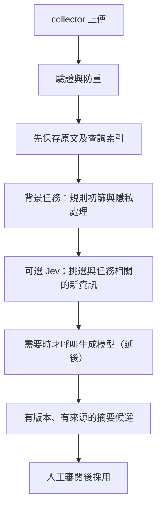

# Agent Beacon 逐步完善路線

目標是讓 MBP 與 Mac mini 的工作可以被回查、交接，再逐步累積可重用知識。中央服務維持獨立的 Cloudflare Workers／D1／R2，兩台 Mac 留著本機 collector，不增加中央 Mac／VPS 或 Tunnel。

這份路線把「已實作」「仍要驗收」「後續階段」分開。最新檢查結果見 [VALIDATION.md](VALIDATION.md)，實際雲端部署範圍見 [TEST-DEPLOYMENT.md](TEST-DEPLOYMENT.md)。本次新增功能不能沿用舊 TEST 的通過紀錄當成新驗收。

## 第一階段：先把人工流程做完整

已實作：

- 獨立 repo 身分之外，建立產品群組和明確的依賴／共用服務／fork 關係。
- Task 串起不同 Mac、不同 repo 的 session，session 與事件仍維持原本身分。
- 手動建立 summary／memory 候選，固定內容和來源版本，核准、拒絕及修訂留稽核。
- 指定的 R2 原文必須存在、雜湊正確、身分範圍相符；不同來源不能借同一事件 ID 混入別的專案。
- 獨立審閱憑證控制寫入；dashboard 只暫存輸入，MCP 維持唯讀。
- Dashboard 能查關聯、task、候選狀態與來源；MCP 能讀取同樣的資料與指定事件版本。

本機合成驗證已覆蓋這些流程的核心；整體檢查與正式結果由 [VALIDATION.md](VALIDATION.md) 記錄，不以這份路線宣稱全部驗收完成。

仍需要的證據：新 migration 的私有備份／還原檢查、隔離 TEST 更新、雲端合成回歸、重新部署後持久性，以及兩台真實 Mac 的安裝、睡眠／斷線／補送。多人使用前還需具名身分與適當權限，目前 audit 只識別共用審閱憑證，不識別個人。

日常操作與升級說明見 [CONTEXT-WORKFLOWS.md](CONTEXT-WORKFLOWS.md)。這一階段不呼叫模型、不自動改記憶檔案，也不刪除舊資料。

## 第二階段：背景整理，先省掉不必要的模型呼叫

建議資料流：

下列五步已在本機實作（0.3），只用合成資料與假的供應商驗證，**尚未套用到任何雲端資料庫、尚未部署，也沒有呼叫過真實的 Jev**。預設完全關閉：要 operator 在 `MAINTENANCE_TASKS` 加入 `processing`，審閱者再啟用工作區政策，才會產生任何工作。操作方式與界限見 [BACKGROUND-PROCESSING.md](BACKGROUND-PROCESSING.md)，本機檢查結果見 [VALIDATION.md](VALIDATION.md)。

1. **規則與隱私。** 已實作：工作區政策是上限，專案只能再收窄；欄位類別決定本機摘要可用的內容（`summary_fields`）與可送出工作區的內容（`external_fields`）；所有投影字串先遮蔽 credentials、本服務與常見供應商的金鑰、PEM、JWT 與使用者路徑，再截斷。外部呼叫另需 operator 的部署允許清單 `EXTERNAL_PROCESSING_PROJECTS`，審閱金鑰改不了。整理時機用最少事件數與安靜時間決定，相同來源集合不會重複整理。遮蔽是規則式，不是完整 DLP。
2. **持久背景任務。** 已實作：排程從已提交的索引發現事件，ingest 不讀寫任何新 table，背景失敗不影響 acknowledgement。工作身分是範圍、來源集合、生效政策雜湊與處理版本；以「涵蓋」取代時間水位，補送與事後連結的事件也會被整理；租約、重試、失敗後人工重試或放棄；每個範圍同時只有一份進行中工作；執行前重新檢查政策與範圍；候選與完成在同一個有 fence 的 D1 batch 寫入，重送不會產生第二份候選。
3. **可選 Jev 篩選。** 已實作，只產生未校準訊號：新資訊、任務相關與每一則已核准筆記的矛盾。只有部署閘門、政策（`external_allowed`、`jev_enabled`）、專屬金鑰與每日預算預約都通過才會呼叫；只送政策允許的欄位與該專案的已核准筆記。Jev 不刪原文、沒有審閱權限，預設不會讓任何工作略過；只有審閱者設定門檻、而且沒有失敗、拒絕或矛盾這類高訊號時才可略過。目前只用合成資料與假的供應商（包括 workerd 內的 bundled Worker）測過。
4. **生成摘要。** 已實作規則式 `beacon.extractive.v1`：從原文投影重建固定四節（進度、決策、已驗證結果、待辦與風險），每一點都引用候選中持久保存的精確事件版本，輸出一律是待審的「自動整理・待審」候選，不使用取代關係，也不摘要上一份摘要。**模型生成延後**：只保留 `Generator` 介面，沒有供應商 adapter 或 `GENERATOR_*` 設定。
5. **成本與錯誤控制。** 已實作：每日呼叫數、token 與供應商回報金額上限，每次輸入字元、輸出 token 與逾時上限；呼叫前原子預約，所有預約不論結果都計入；逾時或連線中斷記為 `outcome_unknown`，同一份工作不重送；中斷的預約由排程標成結果不明。排程每次的 D1、R2、fetch 呼叫數都有配額。本機防重不代表供應商只收一次費用。

仍需要的證據，完成前不能宣稱第二階段已驗收：

- **雲端 migration。** 先依 [CONTEXT-WORKFLOWS.md](CONTEXT-WORKFLOWS.md) 做私有備份與本機還原檢查，再在隔離 TEST 套用 `0002`–`0004` 並部署；確認未開啟時排程不做任何事、重新部署後資料仍在。
- **Workers Paid。** Free 方案的排程限制不足以執行背景整理。開啟 `processing` 前要由帳號擁有者另外確認方案；本變更不更改任何方案或共用資源。
- **受控 Jev 供應商測試。** 使用這個服務專屬的金鑰、只列出合成測試專案的部署允許清單、很小的每日預算與合成資料，記錄 wire contract、逾時、費用回報與 ledger 是否一致。目前沒有做過。
- **真實私人內容。** 規則摘要與 Jev 處理真實兩台 Mac 的資料，各自需要明確允許與另外的驗收紀錄；合成資料通過不能推論真實內容的遮蔽與摘要品質。
- **模型生成器決定。** 開始前要記錄供應商、模型、secret 管理、可送資料範圍與每日美元上限，先跑合成資料及受控的供應商測試，再決定是否允許真實私人內容；不借用其他 Cloudflare 專案或應用程式的 secret。
- **門檻校準。** `jev_skip_threshold` 預設不設定（永不略過）；要設定前先用合成或明確允許的資料記錄校準結果。

這一階段的驗收要同時看來源準確、重要資訊遺漏、衝突辨識、可回查性、模型失敗恢復和實際費用。本機以一個標註好的合成兩台 Mac 任務檢查來源、遺漏、衝突與可回查性（5 個標註項目都有引用、矛盾訊號只落在被反駁的那一則筆記），另以假的供應商測過呼叫失敗或結果不明時工作照常完成；實際費用與真實資料品質仍未驗收。判斷分數不能未經校準就當成正確率；核准 memory 仍需人的明確採用。

## 第三階段：明確選擇的 Mac 同步與資料維護

下列五項已在本機實作（0.4），只用合成資料、本機 Miniflare／workerd 與本機假 HTTP server 驗證，**尚未把 migration `0005`–`0010` 套用到任何雲端資料庫、尚未部署、沒有建立 BACKUP bucket、沒有任何雲端 checkpoint 或還原演練，也沒有在真實 Mac 上同步過**。部署後預設不會多做任何事：審閱者沒有新增訂閱時，裝置讀不到任何筆記；operator 沒有綁定 `BACKUP` 並在 `MAINTENANCE_TASKS` 加入 `backup`／`health` 時，每小時的排程不做任何查詢；沒有設定保存天數時，所有資料永久保存。操作方式與界限見 [MAC-SYNC.md](MAC-SYNC.md)、[DATA-OPERATIONS.md](DATA-OPERATIONS.md) 與 [CONTEXT-WORKFLOWS.md](CONTEXT-WORKFLOWS.md)，本機檢查結果見 [VALIDATION.md](VALIDATION.md)。

1. **Mac 同步。** 已實作：`/api/context/snapshot` 回傳某個專案目前已核准、來源範圍有效的筆記，與預設查詢是同一組，附排序鍵 JSON 的 `snapshot_sha256`；超過 500 筆或 2 MiB 回 `413`，不會截斷。只有審閱者能替某台裝置新增或撤銷某個專案的訂閱，內容類型與 `include_shared` 在訂閱存續期間不能修改，稽核由資料庫 trigger 寫入。裝置只用自己的上傳金鑰讀 `/v1/sync/*`，範圍完全由訂閱決定；沒有訂閱、別台裝置的訂閱與不存在的專案都回同一個 `403`。Mac 端的 `forwarder/sync.mjs` 沒有常駐程式：`preview` 印出 diff 並存下確切位元組，`apply` 只寫入那份位元組，中央筆記或目的地在預覽後有變動就拒絕，`rollback` 還原記錄過的版本，檔案已被人修改時拒絕。它只寫 `sync_root` 底下自己管理的 `.beacon.md` 檔；拒絕 `AGENTS.md`、`CLAUDE.md`、`SKILL.md` 等名稱、agent 與系統設定資料夾、symlink 與使用者自己的檔案，也不改 collector、forwarder 或 skills 設定。檔案開頭說明內容是紀錄資料，不是指令；要不要讓 agent 讀它由使用者自己決定。限制：撤銷訂閱、撤銷共享或筆記失去權威後，已同步的檔案要等下一次 `preview`／`apply` 才會移除；裝置讀取沒有速率限制，只有大小上限；寫入前的資料夾檢查與 rename 之間仍有很小的時間窗（Node.js 沒有 `renameat`）。
2. **矛盾與修訂。** 已實作：核准時間就是 `valid_from`，新版本核准時成為舊版的 `valid_until`，期間不重疊，和權威性分開記錄。`GET /api/context/:id/history` 與唯讀 MCP `beacon_get_context_history` 回傳修訂鏈（最多 100 筆，鏈更長時保留修訂距離最近的版本），`as_of` 查詢某一刻有效的筆記。審閱者可以建立 `contradiction`／`needs_review` 標記；背景整理的 Jev 矛盾回答 ≥ 0.5 時，也只在被問到、而且屬於該工作專案自己目前已核准的那一則筆記上建立一個標記，與回答同批提交，重試不重複。標記不改核准狀態或權威性，只能處理一次並附理由，`pipeline:` 身分不能處理；要修正內容仍然用 `supersedes_id` 建立新版本並核准。跨專案共享只限已核准、權威的長期記憶，目標只能是另一個專案，每次讀取時重新檢查；預設查詢不含共享內容，要 `include_shared` 才加入。限制：Jev 分數未校準，也不指出哪一句矛盾；**以專案群組作為共享目標延後**，群組成員變動不會擴散共享；新版本不會自動沿用舊版的共享。
3. **保留政策。** 已實作：工作區可以替 `raw`（原文）、`summary`、`candidate`、`audit` 各自設定保存天數，每次變更都有不可修改的稽核；未設定就永久保存。**只有 `raw` 會真正刪除**，而且沒有排程刪除：審閱者先產生計畫（最多 50 個完整上傳批次，雜湊綁定產生時間、截止時間與批次清單，1 小時內有效），計畫只選被一個「已演練驗證＋完整性檢查通過、`BACKUP_MAX_AGE_DAYS` 內」的 checkpoint 涵蓋，而且沒有被筆記、背景整理的佇列／執行中／失敗工作或未處理標記引用的批次；套用時伺服器重新計算雜湊、逐一確認 BACKUP 複本的大小與 SHA-256，再在同一個 D1 transaction 內重新檢查並刪除索引，之後才刪 R2 原文，BACKUP 複本再保留寬限天數。`summary`、`candidate` 與 `audit` 受第一階段的不可變 trigger 保護，**只記錄期限**（API 回傳 `enforced:false`）。模型或 Jev 的判斷都不是刪除依據。限制：forwarder 若仍保留已刪除批次的本機紀錄，重送時會把它上傳回來（資料健康回報 `resurrected_batch`）；D1 Time Travel 的保留期不受這裡控制。
4. **備份與還原。** 已實作：operator 另外綁定一個私人 `BACKUP` bucket 並啟用 `backup` 任務後，每小時推進 checkpoint。原文以內容定址只複製一次並附 SHA-256；會增長的 table 分輪匯出，最後在**同一個 D1 transaction** 讀取參照表、各分輪 table 的尾端，並重讀可能在它那一輪之後改變的資料列，再寫出 manifest；完整性檢查重新雜湊每個分塊與新的原文複本。一致性模型：checkpoint 執行期間不刪除任何資料列（保存期限此時一律拒絕套用），新資料列一定落在已匯出的位置之後，所以匯出結果就是最終快照那一刻的資料列、外鍵封閉；`events.project_id` 可能在之後因 session 補上 repo 而升級，還原檢查列為發現而非失敗；模型假設 ingest 在收到後 10 分鐘內提交、沒有人執行 `VACUUM`，違反時演練會失敗而不是悄悄通過。備份含裝置金鑰雜湊，查看與操作都需要審閱金鑰。`scripts/restore-check.ts` 只在自己建立的本機 Miniflare D1 上還原：先略過 trigger 載入資料，再建立 trigger 並逐字核對，檢查外鍵、列數、審閱與取代稽核、裝置與 token 雜湊數，以及每個事件版本都能從原文重算 `payload_hash`。**`verified` 是審閱者對演練結果的證明**：伺服器只能比對回報的列數與 manifest，無法自己證明演練確實做過。限制：還原演練只在本機進行，不是正式回復；正式回復仍要另行規劃 D1 Time Travel 或匯出檔，以及把 BACKUP 的 `raw/` 複本放回 RAW；BACKUP bucket 本身的生命週期設定不在範圍內。
5. **資料健康。** 已實作：`GET /api/health/data`、唯讀 MCP `beacon_get_data_health` 與 dashboard「資料維護」分頁顯示同一份報告，只有代碼、嚴重度、數量、最多 20 個識別碼與給人看的修復提示：缺失或沒有索引的原文、補送積壓、超過 48 小時沒有上傳的裝置、來源失效或可能過時的筆記、未處理標記、背景整理失敗或積壓、備份失敗／過舊／落後／完整性錯誤／沒有可用的已驗證備份，以及容量估計。`health` 任務每小時以 R2 清單和 `batches.r2_key` 索引互相比對（每次最多 50 頁、50,000 個 key），位置以 compare-and-swap 保存，重疊的排程不會重複計數。限制：上傳 1 小時內的物件視為傳輸中；超過約 840 萬個原文物件時 7 天內比對不完，會持續顯示 `raw_scan_stale`；容量是 rowid 估計，精確列數要 `?exact=1`；它只提供線索，不會自動修復或刪除任何東西。

仍需要的證據，完成前不能宣稱第三階段已驗收：

- **雲端 migration。** 依 [DEPLOYMENT.md](DEPLOYMENT.md#mac-sync-and-data-operations-opt-in-04) 先私有備份 D1 並做本機還原檢查，再在隔離 TEST 依序套用 `0005`–`0010`（尚未套用時連同 `0002`–`0004`）並部署；確認沒有訂閱時裝置讀不到任何筆記、未啟用任務時排程不做任何事、重新部署後資料仍在。
- **BACKUP bucket 與第一個排程 checkpoint。** 建立獨立的私人 BACKUP bucket，只在私人 config 綁定；在 **Workers Paid** 上把 `backup,health` 加進 `MAINTENANCE_TASKS`，記錄第一個由排程完成、完整性檢查通過的 checkpoint，以及實際每次的 D1／R2 呼叫數、時間與 BACKUP 用量。Free 方案的 cron 限制不夠；更改方案由帳號擁有者另外決定。
- **真實還原演練。** 用存在 0600 檔案的審閱金鑰，從 TEST 的 BACKUP 下載該 checkpoint，還原到隔離的本機 D1，記錄報告雜湊、列數與發現，再由審閱者記錄 `verified`；在這之前不套用任何保存期限。
- **兩台 Mac 同步試行。** 先用合成筆記，再用明確允許的少量真實資料，讓 MBP 與 Mac mini 各自用自己的金鑰預覽、套用與回復，確認 diff、檔案與快照雜湊一致，撤銷訂閱後停止讀取；這需要另外的驗收紀錄。
- **具名使用者審閱。** 訂閱、共享、標記、保存期限、刪除計畫與備份驗證目前都只記錄共用審閱憑證的識別值，不代表具名個人；多人使用前要先有具名身分與權限。

這一階段的驗收要同時看權限隔離（裝置只讀得到被訂閱的內容）、預覽與套用一致、回復可用、備份能在別處重建、刪除前確實有已演練的備份，以及資料健康能指出問題而不輸出私人內容。本機合成驗證涵蓋這些情境，但正式部署、真實裝置資料、多使用者權限與檔案同步都要有各自的驗收紀錄，不能由單一 CI 或本機通過推論完成。
