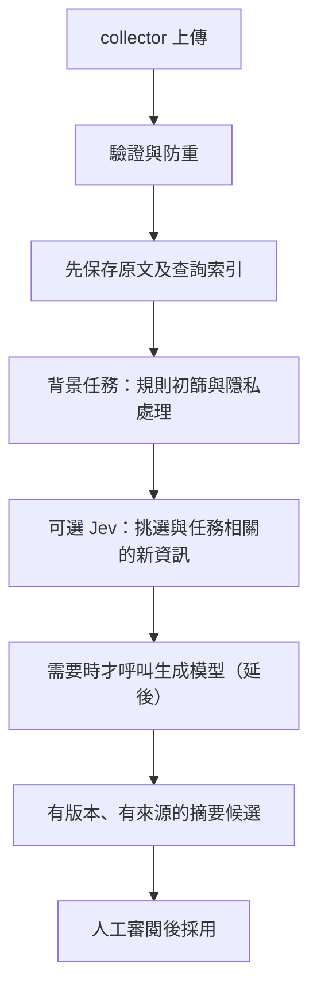

# Agent Beacon 逐步完善路線

目標是讓 MBP 與 Mac mini 的工作可以被回查、交接，再逐步累積可重用知識。中央服務維持獨立的 Cloudflare Workers／D1／R2，兩台 Mac 留著本機 collector，不增加中央 Mac／VPS 或 Tunnel。

這份路線把「已實作」「仍要驗收」「後續階段」分開。最新檢查結果見 [VALIDATION.md](VALIDATION.md)，實際雲端部署範圍見 [TEST-DEPLOYMENT.md](TEST-DEPLOYMENT.md)。本次新增功能不能沿用舊 TEST 的通過紀錄當成新驗收。

## 第一階段：先把人工流程做完整

已實作：

- 獨立 repo 身分之外，建立產品群組和明確的依賴／共用服務／fork 關係。
- Task 串起不同 Mac、不同 repo 的 session，session 與事件仍維持原本身分。
- 手動建立 summary／memory 候選，固定內容和來源版本，核准、拒絕及修訂留稽核。
- 指定的 R2 原文必須存在、雜湊正確、身分範圍相符；不同來源不能借同一事件 ID 混入別的專案。
- 獨立審閱憑證控制寫入；dashboard 只暫存輸入，MCP 維持唯讀。
- Dashboard 能查關聯、task、候選狀態與來源；MCP 能讀取同樣的資料與指定事件版本。

本機合成驗證已覆蓋這些流程的核心；整體檢查與正式結果由 [VALIDATION.md](VALIDATION.md) 記錄，不以這份路線宣稱全部驗收完成。

仍需要的證據：新 migration 的私有備份／還原檢查、隔離 TEST 更新、雲端合成回歸、重新部署後持久性，以及兩台真實 Mac 的安裝、睡眠／斷線／補送。多人使用前還需具名身分與適當權限，目前 audit 只識別共用審閱憑證，不識別個人。

日常操作與升級說明見 [CONTEXT-WORKFLOWS.md](CONTEXT-WORKFLOWS.md)。這一階段不呼叫模型、不自動改記憶檔案，也不刪除舊資料。

## 第二階段：背景整理，先省掉不必要的模型呼叫

建議資料流：

下列五步已在本機實作（0.3），只用合成資料與假的供應商驗證，**尚未套用到任何雲端資料庫、尚未部署，也沒有呼叫過真實的 Jev**。預設完全關閉：要 operator 在 `MAINTENANCE_TASKS` 加入 `processing`，審閱者再啟用工作區政策，才會產生任何工作。操作方式與界限見 [BACKGROUND-PROCESSING.md](BACKGROUND-PROCESSING.md)，本機檢查結果見 [VALIDATION.md](VALIDATION.md)。

1. **規則與隱私。** 已實作：工作區政策是上限，專案只能再收窄；欄位類別決定本機摘要可用的內容（`summary_fields`）與可送出工作區的內容（`external_fields`）；所有投影字串先遮蔽 credentials、本服務與常見供應商的金鑰、PEM、JWT 與使用者路徑，再截斷。外部呼叫另需 operator 的部署允許清單 `EXTERNAL_PROCESSING_PROJECTS`，審閱金鑰改不了。整理時機用最少事件數與安靜時間決定，相同來源集合不會重複整理。遮蔽是規則式，不是完整 DLP。
2. **持久背景任務。** 已實作：排程從已提交的索引發現事件，ingest 不讀寫任何新 table，背景失敗不影響 acknowledgement。工作身分是範圍、來源集合、生效政策雜湊與處理版本；以「涵蓋」取代時間水位，補送與事後連結的事件也會被整理；租約、重試、失敗後人工重試或放棄；每個範圍同時只有一份進行中工作；執行前重新檢查政策與範圍；候選與完成在同一個有 fence 的 D1 batch 寫入，重送不會產生第二份候選。
3. **可選 Jev 篩選。** 已實作，只產生未校準訊號：新資訊、任務相關與每一則已核准筆記的矛盾。只有部署閘門、政策（`external_allowed`、`jev_enabled`）、專屬金鑰與每日預算預約都通過才會呼叫；只送政策允許的欄位與該專案的已核准筆記。Jev 不刪原文、沒有審閱權限，預設不會讓任何工作略過；只有審閱者設定門檻、而且沒有失敗、拒絕或矛盾這類高訊號時才可略過。目前只用合成資料與假的供應商（包括 workerd 內的 bundled Worker）測過。
4. **生成摘要。** 已實作規則式 `beacon.extractive.v1`：從原文投影重建固定四節（進度、決策、已驗證結果、待辦與風險），每一點都引用候選中持久保存的精確事件版本，輸出一律是待審的「自動整理・待審」候選，不使用取代關係，也不摘要上一份摘要。**模型生成延後**：只保留 `Generator` 介面，沒有供應商 adapter 或 `GENERATOR_*` 設定。
5. **成本與錯誤控制。** 已實作：每日呼叫數、token 與供應商回報金額上限，每次輸入字元、輸出 token 與逾時上限；呼叫前原子預約，所有預約不論結果都計入；逾時或連線中斷記為 `outcome_unknown`，同一份工作不重送；中斷的預約由排程標成結果不明。排程每次的 D1、R2、fetch 呼叫數都有配額。本機防重不代表供應商只收一次費用。

仍需要的證據，完成前不能宣稱第二階段已驗收：

- **雲端 migration。** 先依 [CONTEXT-WORKFLOWS.md](CONTEXT-WORKFLOWS.md) 做私有備份與本機還原檢查，再在隔離 TEST 套用 `0002`–`0004` 並部署；確認未開啟時排程不做任何事、重新部署後資料仍在。
- **Workers Paid。** Free 方案的排程限制不足以執行背景整理。開啟 `processing` 前要由帳號擁有者另外確認方案；本變更不更改任何方案或共用資源。
- **受控 Jev 供應商測試。** 使用這個服務專屬的金鑰、只列出合成測試專案的部署允許清單、很小的每日預算與合成資料，記錄 wire contract、逾時、費用回報與 ledger 是否一致。目前沒有做過。
- **真實私人內容。** 規則摘要與 Jev 處理真實兩台 Mac 的資料，各自需要明確允許與另外的驗收紀錄；合成資料通過不能推論真實內容的遮蔽與摘要品質。
- **模型生成器決定。** 開始前要記錄供應商、模型、secret 管理、可送資料範圍與每日美元上限，先跑合成資料及受控的供應商測試，再決定是否允許真實私人內容；不借用其他 Cloudflare 專案或應用程式的 secret。
- **門檻校準。** `jev_skip_threshold` 預設不設定（永不略過）；要設定前先用合成或明確允許的資料記錄校準結果。

這一階段的驗收要同時看來源準確、重要資訊遺漏、衝突辨識、可回查性、模型失敗恢復和實際費用。本機以一個標註好的合成兩台 Mac 任務檢查來源、遺漏、衝突與可回查性（5 個標註項目都有引用、矛盾訊號只落在被反駁的那一則筆記），另以假的供應商測過呼叫失敗或結果不明時工作照常完成；實際費用與真實資料品質仍未驗收。判斷分數不能未經校準就當成正確率；核准 memory 仍需人的明確採用。

## 第三階段：明確選擇的 Mac 同步與資料維護

尚未實作，另以獨立變更處理。排程已預留每小時的 cron，但目前沒有任何第三階段的任務、API 或 table。先完成可靠的已核准筆記查詢，再加入：

- **Mac 同步。** 每台裝置明確選擇接收哪些專案的已核准版本、寫到哪個目的地；先預覽 diff，再更新，保留版本與回復方式。不能因為 MCP 讀到了文字，就擅自改 `AGENTS.md`、skills 或本機 collector 設定。
- **矛盾與修訂。** 新設定和舊設定留下有效時間與取代關係；跨專案共用經驗另定可採用範圍，不把所有專案的筆記自動混成同一份。
- **保留政策。** 由工作區明確指定原文、摘要、候選和 audit 的保存期限；備份確認前不自動刪除。模型的「不重要」判斷不是刪除原始資料的授權。
- **備份與還原。** 定期備份 D1 與私人 R2，記錄對應 checkpoint；先在獨立環境還原並核對來源、版本、審閱和裝置身分，再規劃正式回復。
- **資料健康。** 監控補送積壓、缺失原文、stale 筆記、索引／R2 不一致與容量；在不輸出私人內容的前提下提供修復線索。

每項都先使用合成資料，確認隔離、權限、重試及回復，再用明確允許的少量真實裝置資料試行。正式部署、多使用者權限、私人內容送模型及檔案同步，都要有各自的驗收紀錄，不能由單一 CI 通過推論完成。
